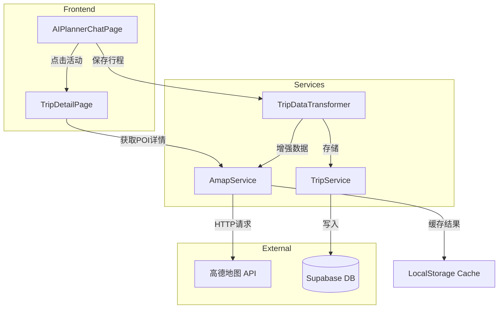

# Design Document

## Overview

本设计实现 AI Planner 与 TripDetailPage 之间的数据增强流程。AI Planner 保持概览展示，活动项支持点击跳转到详情页。详情页通过高德地图 API 获取补充信息（地址、图片、营业时间等），实现 AI 生成数据与实时 POI 数据的融合展示。

## Architecture



## Components and Interfaces

### 1. AmapService (新增)

高德地图 API 服务封装，提供 POI 搜索、详情获取、路线规划等功能。

```typescript
// src/services/amapService.ts

interface AmapPOI {
  id: string;
  name: string;
  type: string;
  address: string;
  location: string; // "lng,lat"
  tel?: string;
  rating?: string;
  cost?: string;
  opentime?: string;
  photos?: Array<{ url: string }>;
}

interface AmapSearchResult {
  status: string;
  count: string;
  pois: AmapPOI[];
}

interface AmapRouteResult {
  status: string;
  route: {
    paths: Array<{
      distance: string;
      duration: string;
      steps: Array<{
        instruction: string;
        distance: string;
        duration: string;
      }>;
    }>;
  };
}

interface AmapServiceInterface {
  // POI 关键字搜索
  searchPOI(keyword: string, city: string, type?: string): Promise<AmapPOI[]>;
  
  // 根据坐标获取周边 POI
  searchNearby(lat: number, lng: number, keyword: string, radius?: number): Promise<AmapPOI[]>;
  
  // 获取 POI 详情
  getPOIDetail(poiId: string): Promise<AmapPOI | null>;
  
  // 路线规划
  getRoute(origin: string, destination: string, mode: 'walking' | 'driving' | 'transit'): Promise<AmapRouteResult | null>;
  
  // 缓存管理
  getCachedPOI(key: string): AmapPOI | null;
  setCachedPOI(key: string, poi: AmapPOI): void;
}
```

### 2. AIPlannerChatPage (修改)

添加活动点击处理，支持跳转到详情页。

```typescript
// 新增 Props
interface AIPlannerChatPageProps {
  onBack: () => void;
  onSaveSuccess?: () => void;
  initialPlan?: string;
  onActivityClick?: (activity: Activity, dayNumber: number) => void; // 新增
}

// Activity 类型扩展
interface Activity {
  time: string;
  name: string;
  description: string;
  type: 'attraction' | 'transport' | 'rest' | 'meal';
  geoCoordinates?: {
    lat: number;
    lng: number;
  };
  // AI 可能提供的额外信息
  duration?: string;
  price?: string;
  address?: string;
}
```

### 3. TripDetailPage (修改)

增强详情展示，集成高德 API 数据获取。

```typescript
// 新增状态
interface EnhancedActivityDetail {
  // 基础信息 (来自 AI)
  name: string;
  description: string;
  time: string;
  type: string;
  coordinates?: { lat: number; lng: number };
  
  // 增强信息 (来自高德 API)
  address?: string;
  tel?: string;
  rating?: string;
  opentime?: string;
  cost?: string;
  photos?: string[];
  
  // 路线信息 (交通类型)
  route?: {
    distance: string;
    duration: string;
    steps: Array<{ instruction: string }>;
  };
  
  // 数据来源标记
  dataSource: 'ai' | 'amap' | 'mixed';
}
```

### 4. TripDataTransformer (修改)

保存时获取高德数据增强。

```typescript
// 新增方法
interface TripDataTransformerInterface {
  // 现有方法
  transform(plan: TripPlan, userId: string): TransformedTripData;
  
  // 新增：带高德数据增强的转换
  transformWithEnhancement(plan: TripPlan, userId: string): Promise<TransformedTripData>;
}
```

## Data Models

### 高德 API 响应缓存结构

```typescript
interface POICache {
  key: string; // `${name}_${lat}_${lng}`
  data: AmapPOI;
  timestamp: number;
  expiresIn: number; // 默认 24 小时
}
```

### Activity 类型映射

| AI Type | 高德 POI Type | 说明 |
|---------|--------------|------|
| attraction | 风景名胜\|博物馆\|公园 | 景点类 |
| meal | 餐饮服务 | 餐厅类 |
| transport | - | 使用路线规划 API |
| rest | 酒店\|休闲场所 | 休息类 |

## Correctness Properties

*A property is a characteristic or behavior that should hold true across all valid executions of a system-essentially, a formal statement about what the system should do. Properties serve as the bridge between human-readable specifications and machine-verifiable correctness guarantees.*

### Property 1: Type-based API Routing

*For any* activity with a valid type (attraction, meal, transport, rest), the system SHALL route the API call to the appropriate Amap endpoint based on the activity type.

**Validates: Requirements 4.1, 6.1, 7.1, 8.1**

### Property 2: Graceful Degradation

*For any* API error or empty response from Amap, the system SHALL fall back to displaying AI-provided data without crashing or showing error states to the user.

**Validates: Requirements 3.3, 4.3, 9.3**

### Property 3: POI Cache Consistency

*For any* POI query with the same parameters (name + coordinates), the second query within the cache TTL SHALL return cached data without making a new API call.

**Validates: Requirements 4.4**

### Property 4: Image Fallback Chain

*For any* activity, if Amap photos are unavailable, the system SHALL provide a category-appropriate default image based on the activity type.

**Validates: Requirements 5.1, 5.2**

### Property 5: Activity Data Passthrough

*For any* activity clicked in AI Planner, the navigation to TripDetailPage SHALL include the activity's name, type, description, and coordinates (if available).

**Validates: Requirements 2.2**

### Property 6: Save Data Completeness

*For any* saved trip, each activity SHALL contain either Amap-enhanced data or AI-provided fallback data for fields: address, duration, price.

**Validates: Requirements 9.1, 9.2**

## Error Handling

### API 错误处理策略

```typescript
enum AmapErrorType {
  NETWORK_ERROR = 'NETWORK_ERROR',
  RATE_LIMIT = 'RATE_LIMIT',
  INVALID_KEY = 'INVALID_KEY',
  NO_RESULTS = 'NO_RESULTS',
  UNKNOWN = 'UNKNOWN'
}

interface ErrorHandler {
  // 错误分类
  classifyError(error: any): AmapErrorType;
  
  // 重试策略
  shouldRetry(errorType: AmapErrorType): boolean;
  
  // 降级策略
  getFallbackData(activity: Activity): EnhancedActivityDetail;
}
```

### 降级策略

1. **网络错误**: 使用缓存数据（如有），否则使用 AI 数据
2. **频率限制**: 延迟重试，使用 AI 数据作为临时展示
3. **无结果**: 直接使用 AI 数据，标记 dataSource 为 'ai'
4. **API Key 无效**: 记录错误日志，全部使用 AI 数据

## Testing Strategy

### 单元测试

- AmapService 各方法的正确性
- 缓存读写逻辑
- 错误分类和降级逻辑
- 数据转换逻辑

### 属性测试

使用 fast-check 进行属性测试：

1. **Type-based Routing**: 生成随机活动类型，验证 API 路由正确
2. **Graceful Degradation**: 模拟各种错误，验证降级行为
3. **Cache Consistency**: 重复查询验证缓存命中
4. **Image Fallback**: 各类型活动验证默认图片
5. **Data Passthrough**: 验证导航参数完整性
6. **Save Completeness**: 验证保存数据字段完整

### 集成测试

- AI Planner → TripDetailPage 导航流程
- 高德 API 实际调用（使用测试 Key）
- 保存流程端到端测试
