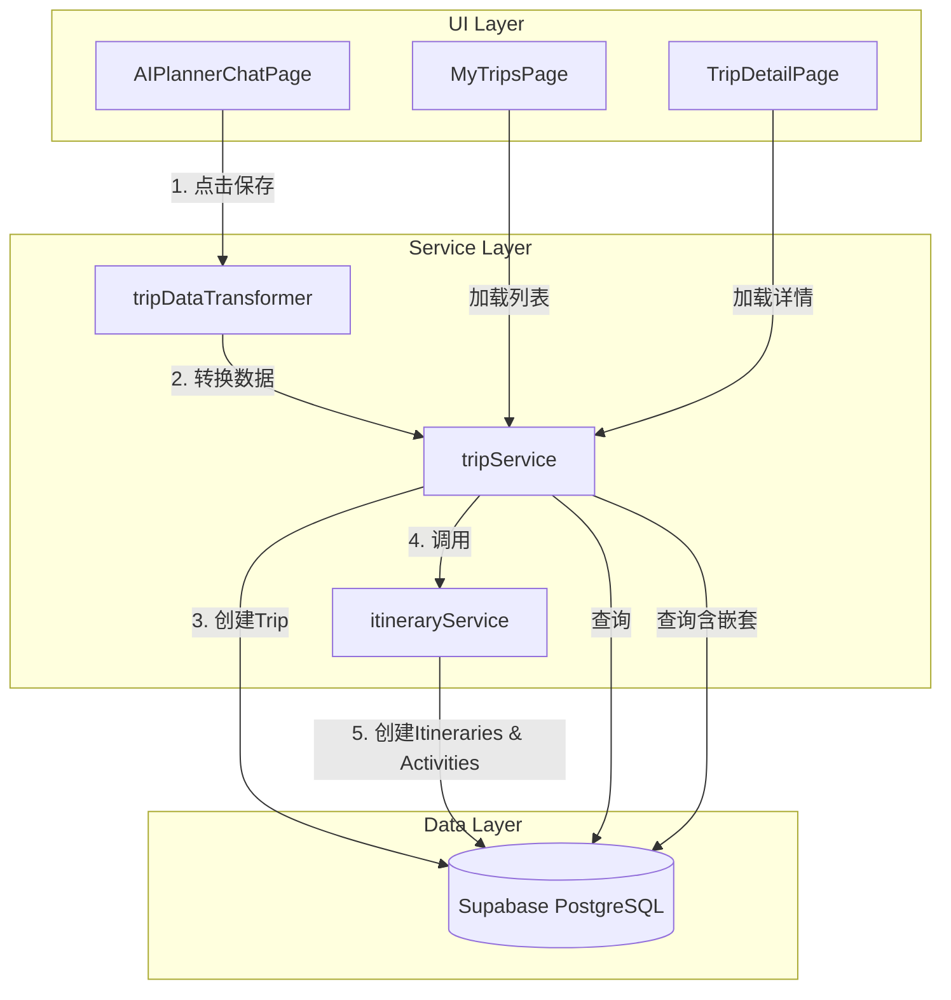
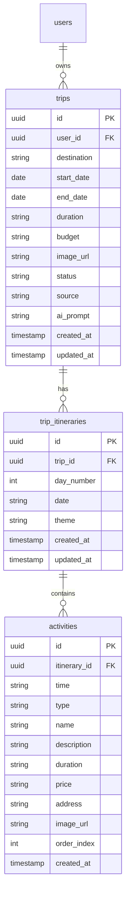

# Design Document: AI Trip Save Flow

## Overview

本设计文档描述了AI行程规划页面（AIPlannerChatPage）保存行程到数据库的完整流程。核心目标是打通AI生成的行程方案与用户行程管理之间的数据流，实现端到端的行程保存、查看和管理功能。

### 设计目标

1. 实现"保存方案"按钮的完整功能
2. 提供可靠的数据转换层，将AI生成的数据结构转换为数据库格式
3. 扩展服务层支持原子性的行程创建
4. 优化TripDetailPage支持从数据库加载真实数据
5. 提供清晰的用户反馈和错误处理

## Architecture



### 数据流

1. 用户在AIPlannerChatPage点击"保存方案"
2. tripDataTransformer将TripPlan转换为数据库格式
3. tripService.createTripWithItineraries创建完整行程
4. 成功后显示通知，提供跳转到MyTripsPage的选项
5. MyTripsPage和TripDetailPage从数据库加载真实数据

## Components and Interfaces

### 1. tripDataTransformer (新增)

数据转换工具，负责将AI生成的TripPlan转换为数据库插入格式。

```typescript
// src/utils/tripDataTransformer.ts

import type { TripInsert } from '@/services/tripService';
import type { TripItineraryInsert, ActivityInsert } from '@/services/itineraryService';

// AI生成的行程方案类型
interface TripPlan {
  destination: string;
  dates: string;  // 格式: "2024年10月1日 - 10月7日"
  budget: string;
  days: DayPlan[];
}

interface DayPlan {
  day: number;
  theme: string;
  activities: PlanActivity[];
  meals: {
    breakfast?: string;
    lunch?: string;
    dinner?: string;
  };
  alternativePlan?: string;
}

interface PlanActivity {
  time: string;
  name: string;
  description: string;
  type: 'attraction' | 'transport' | 'rest';
}

// 转换结果类型
interface TransformedTripData {
  trip: TripInsert;
  itineraries: {
    itinerary: Omit<TripItineraryInsert, 'trip_id'>;
    activities: Omit<ActivityInsert, 'itinerary_id'>[];
  }[];
}

export const tripDataTransformer = {
  /**
   * 解析日期字符串
   * @param dateStr - 格式: "2024年10月1日 - 10月7日"
   * @returns { startDate: string, endDate: string } ISO格式日期
   */
  parseDates(dateStr: string): { startDate: string; endDate: string };

  /**
   * 将AI活动类型映射到数据库类型
   */
  mapActivityType(type: 'attraction' | 'transport' | 'rest'): string;

  /**
   * 转换完整的TripPlan为数据库格式
   * @param plan - AI生成的行程方案
   * @param userId - 当前用户ID
   * @returns TransformedTripData
   */
  transform(plan: TripPlan, userId: string): TransformedTripData;
};
```

### 2. tripService 扩展

在现有tripService基础上添加原子性创建方法。

```typescript
// src/services/tripService.ts (扩展)

export const tripService = {
  // ... 现有方法保持不变

  /**
   * 创建完整行程（含每日行程和活动）
   * 原子性操作：创建trip -> 创建itineraries -> 创建activities
   * 
   * @param tripData - 转换后的行程数据
   * @returns Promise<TripDetail> - 完整的行程对象
   */
  async createTripWithItineraries(tripData: TransformedTripData): Promise<TripDetail>;
};
```

### 3. AIPlannerChatPage 更新

添加保存功能和状态管理。

```typescript
// src/components/AIPlannerChatPage.tsx (更新)

interface AIPlannerChatPageProps {
  onBack: () => void;
  onNavigateToTrips?: () => void;  // 新增：导航到我的行程
  initialPlan?: string;
}

// 新增状态
const [isSaving, setIsSaving] = useState(false);
const [saveSuccess, setSaveSuccess] = useState(false);
const [savedTripId, setSavedTripId] = useState<string | null>(null);

// 保存方法
const handleSavePlan = async () => {
  if (!currentUser) {
    // 提示登录
    return;
  }
  if (!currentPlan) return;
  
  setIsSaving(true);
  try {
    const transformedData = tripDataTransformer.transform(currentPlan, currentUser.id);
    const savedTrip = await tripService.createTripWithItineraries(transformedData);
    setSavedTripId(savedTrip.id);
    setSaveSuccess(true);
    // 显示成功通知
  } catch (error) {
    // 显示错误通知
  } finally {
    setIsSaving(false);
  }
};
```

### 4. TripDetailPage 更新

支持从数据库加载真实数据。

```typescript
// src/components/TripDetailPage.tsx (更新)

// 新增状态
const [tripData, setTripData] = useState<TripDetail | null>(null);
const [loading, setLoading] = useState(true);
const [error, setError] = useState<string | null>(null);

// 加载数据
useEffect(() => {
  const loadTripDetail = async () => {
    try {
      setLoading(true);
      const data = await tripService.getTripDetail(tripId);
      setTripData(data);
    } catch (err) {
      setError(err instanceof Error ? err.message : '加载失败');
    } finally {
      setLoading(false);
    }
  };
  
  loadTripDetail();
}, [tripId]);
```

## Data Models

### 数据库表关系



### 类型映射

| TripPlan字段 | 数据库字段 | 转换逻辑 |
|-------------|-----------|---------|
| destination | trips.destination | 直接映射 |
| dates | trips.start_date, trips.end_date | 解析日期字符串 |
| budget | trips.budget | 直接映射 |
| days.length | trips.duration | 计算天数 |
| - | trips.source | 固定值 'ai' |
| days[].day | trip_itineraries.day_number | 直接映射 |
| days[].theme | trip_itineraries.theme | 直接映射 |
| days[].activities[].time | activities.time | 直接映射 |
| days[].activities[].type | activities.type | 类型映射 |
| days[].activities[].name | activities.name | 直接映射 |
| days[].activities[].description | activities.description | 直接映射 |

## Correctness Properties

*A property is a characteristic or behavior that should hold true across all valid executions of a system-essentially, a formal statement about what the system should do. Properties serve as the bridge between human-readable specifications and machine-verifiable correctness guarantees.*

### Property 1: Complete Trip Structure Creation

*For any* valid TripPlan with N days and M total activities, saving the plan SHALL create exactly 1 trip record, N trip_itinerary records, and M activity records in the database.

**Validates: Requirements 1.1, 1.2, 1.3**

### Property 2: Data Transformation Correctness

*For any* valid TripPlan object, the tripDataTransformer SHALL produce a TransformedTripData object where:
- trip.destination equals plan.destination
- trip.budget equals plan.budget
- trip.source equals 'ai'
- itineraries.length equals plan.days.length
- each itinerary.day_number equals the corresponding day.day
- total activities count equals sum of all day.activities.length

**Validates: Requirements 2.1, 2.2, 2.3, 2.4, 2.5, 2.6**

### Property 3: Date Parsing Correctness

*For any* valid date string in format "YYYY年M月D日 - M月D日", parsing SHALL produce:
- startDate as a valid ISO date string
- endDate as a valid ISO date string
- endDate >= startDate

**Validates: Requirements 2.2**

### Property 4: Round-Trip Data Consistency

*For any* valid TripPlan object, transforming then saving then retrieving via getTripDetail SHALL produce a TripDetail where:
- destination matches original
- budget matches original
- number of itineraries matches original days count
- total activities count matches original

**Validates: Requirements 2.7**

### Property 5: Trip Detail Data Loading

*For any* saved trip with itineraries and activities, calling getTripDetail SHALL return:
- the trip record with all fields
- nested trip_itineraries array sorted by day_number
- nested activities array for each itinerary sorted by order_index

**Validates: Requirements 4.1, 4.2, 6.6**

### Property 6: Foreign Key Integrity

*For any* trip created via createTripWithItineraries:
- all trip_itineraries.trip_id SHALL equal the created trip.id
- all activities.itinerary_id SHALL equal their parent itinerary.id

**Validates: Requirements 6.3, 6.4**

## Error Handling

### 错误类型和处理策略

| 错误场景 | 错误类型 | 处理策略 | 用户提示 |
|---------|---------|---------|---------|
| 用户未登录 | AuthError | 阻止操作，提示登录 | "请先登录后再保存行程" |
| 日期解析失败 | ValidationError | 使用默认日期 | 静默处理 |
| 数据库写入失败 | DatabaseError | 记录日志，显示错误 | "保存失败，请重试" |
| 网络错误 | NetworkError | 允许重试 | "网络错误，请检查连接" |
| 数据转换失败 | TransformError | 记录日志，显示错误 | "数据格式错误" |

### 错误处理代码示例

```typescript
try {
  const result = await tripService.createTripWithItineraries(data);
  // 成功处理
} catch (error) {
  if (error instanceof AuthError) {
    showLoginPrompt();
  } else if (error instanceof DatabaseError) {
    console.error('[SaveTrip] Database error:', error);
    showErrorToast('保存失败，请重试');
  } else {
    console.error('[SaveTrip] Unexpected error:', error);
    showErrorToast('发生未知错误');
  }
}
```

## Testing Strategy

### 单元测试

1. **tripDataTransformer测试**
   - 测试日期解析各种格式
   - 测试活动类型映射
   - 测试完整转换流程
   - 测试边界情况（空数组、缺失字段）

2. **tripService.createTripWithItineraries测试**
   - 测试成功创建完整行程
   - 测试部分失败时的错误处理
   - 测试返回数据结构正确性

### 属性测试

使用 fast-check 进行属性测试：

```typescript
import fc from 'fast-check';

// Property 1: Complete Trip Structure Creation
test('saving creates correct number of records', async () => {
  await fc.assert(
    fc.asyncProperty(
      arbitraryTripPlan(),
      async (plan) => {
        const result = await tripService.createTripWithItineraries(
          tripDataTransformer.transform(plan, testUserId)
        );
        
        expect(result.trip_itineraries.length).toBe(plan.days.length);
        
        const totalActivities = plan.days.reduce(
          (sum, day) => sum + day.activities.length, 0
        );
        const savedActivities = result.trip_itineraries.reduce(
          (sum, it) => sum + it.activities.length, 0
        );
        expect(savedActivities).toBe(totalActivities);
      }
    ),
    { numRuns: 100 }
  );
});

// Property 4: Round-Trip Data Consistency
test('transform-save-retrieve produces equivalent data', async () => {
  await fc.assert(
    fc.asyncProperty(
      arbitraryTripPlan(),
      async (plan) => {
        const transformed = tripDataTransformer.transform(plan, testUserId);
        const saved = await tripService.createTripWithItineraries(transformed);
        const retrieved = await tripService.getTripDetail(saved.id);
        
        expect(retrieved.destination).toBe(plan.destination);
        expect(retrieved.budget).toBe(plan.budget);
        expect(retrieved.trip_itineraries.length).toBe(plan.days.length);
      }
    ),
    { numRuns: 100 }
  );
});
```

### 集成测试

1. **端到端保存流程**
   - 模拟用户在AIPlannerChatPage点击保存
   - 验证数据正确写入数据库
   - 验证MyTripsPage显示新行程

2. **TripDetailPage数据加载**
   - 创建测试行程数据
   - 验证页面正确加载和显示

### 测试配置

- 属性测试最少运行100次迭代
- 使用测试数据库隔离测试数据
- 每个测试后清理创建的数据
