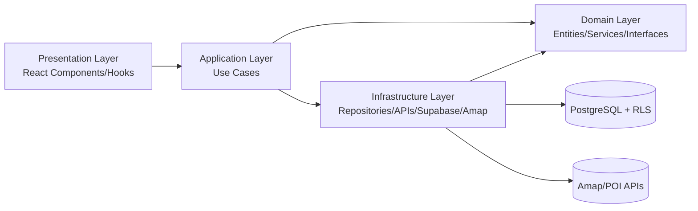
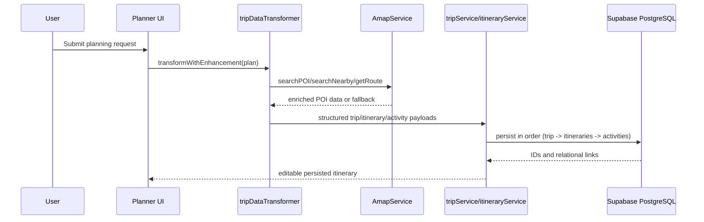
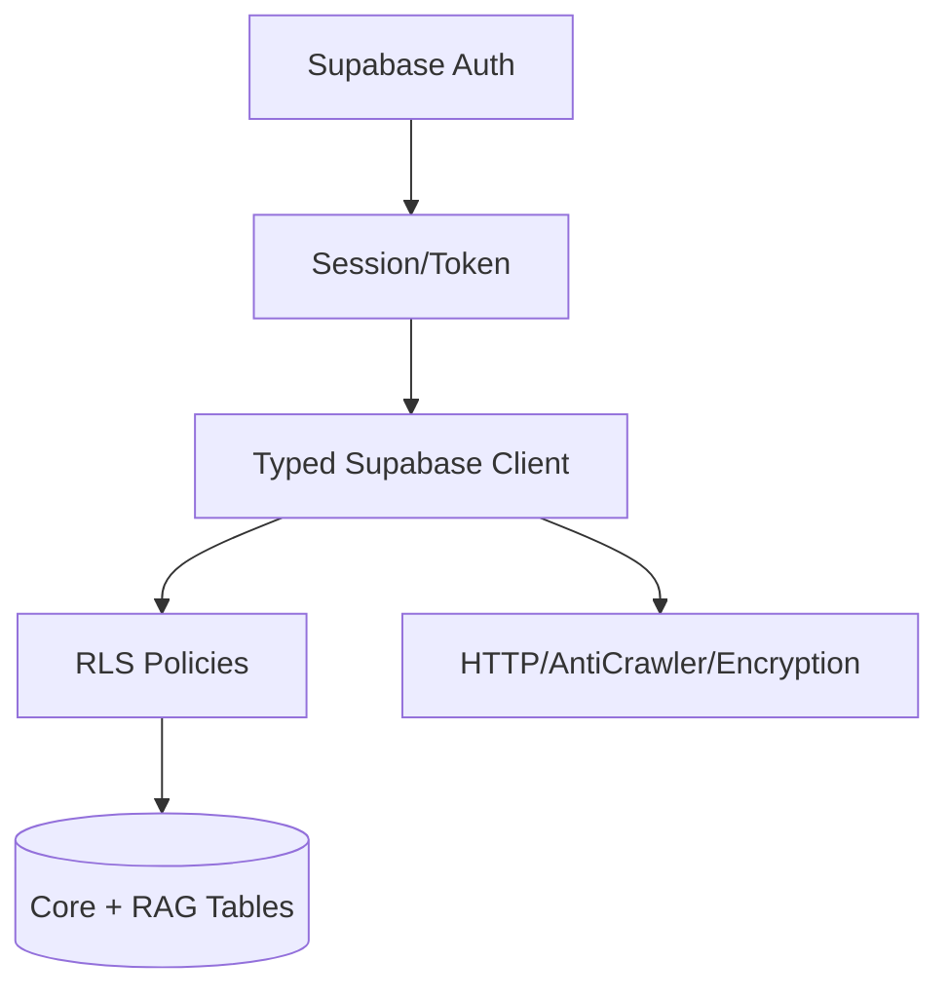

# Methodology

## 1. Research Design
This project adopts a **Design Science Research (DSR)** orientation with an engineering implementation cycle. The goal is not merely to demonstrate that a large language model can produce fluent travel text, but to construct and justify a software artifact that addresses a concrete problem in China-focused trip planning: integrating local knowledge, spatial constraints, and interactive generation into executable multi-day itineraries.

The methodology is structured as four linked loops:
- `Problem framing`: identify the planning friction caused by fragmented platforms and weak executability.
- `Artifact design`: design a layered software solution with retrieval augmentation, POI execution support, and security controls.
- `Implementation and iteration`: deliver through staged milestones and evidence-backed technical increments.
- `Evaluation planning`: define controlled comparisons for subsequent empirical validation.

This framing ensures that design choices are requirement-led rather than technology-led.

## 2. Requirements-Led Design Logic

### 2.1 Requirement elicitation
Requirements were consolidated from:
- The formal project specification (functional scope, architecture constraints, and evaluation expectations).
- The current implementation boundary (implemented features vs transitional/mock surfaces).
- Non-functional constraints (security, data governance, maintainability, and explainability).

### 2.2 Traceability model
A traceability approach was used to connect each major requirement to design decisions and code-level evidence.

| Requirement | Design decision | Evidence |
|---|---|---|
| Personalized, editable multi-day planning | DDD layered architecture with explicit use cases | [src/ARCHITECTURE.md](/mnt/d/chinaview/Nodb/src/ARCHITECTURE.md), [src/application/use-cases/CreateTripUseCase.ts](/mnt/d/chinaview/Nodb/src/application/use-cases/CreateTripUseCase.ts) |
| Executable planning rather than text-only planning | POI/map enrichment as execution support layer | [src/services/amapService.ts](/mnt/d/chinaview/Nodb/src/services/amapService.ts), [src/utils/tripDataTransformer.ts](/mnt/d/chinaview/Nodb/src/utils/tripDataTransformer.ts) |
| Secure multi-user isolation | Supabase Auth + PostgreSQL Row Level Security (RLS) | [supabase/migrations/002_create_core_tables.sql](/mnt/d/chinaview/Nodb/supabase/migrations/002_create_core_tables.sql), [src/utils/supabase/client.ts](/mnt/d/chinaview/Nodb/src/utils/supabase/client.ts) |
| Social sharing and interaction metrics | Shared trip and interaction schema with trigger-based counters | [supabase/migrations/002_create_core_tables.sql](/mnt/d/chinaview/Nodb/supabase/migrations/002_create_core_tables.sql) |
| RAG extensibility | Vector-ready knowledge schema and retrieval functions | [supabase/migrations/003_create_rag_tables.sql](/mnt/d/chinaview/Nodb/supabase/migrations/003_create_rag_tables.sql) |

This requirement–design–evidence chain is central to justifying the solution against project objectives.

## 3. Design of the Solution and Justification of Choices

### 3.1 Why DDD and layered separation
The solution is organized into Domain, Application, Infrastructure, and Presentation layers. This was selected to:
- keep business rules independent from UI frameworks and external services,
- improve testability by expressing actions as use cases,
- support long-term evolution of planning logic without architecture erosion.

Given the project scope (planning, sharing, preferences, and access control), this separation reduces coupling and prevents business logic leakage into UI components.

### 3.2 Why PostgreSQL + Supabase over KV-style persistence
A relational backend was preferred over KV-style storage for four reasons:
- native modeling of hierarchical trip structures (`trip -> itinerary -> activities`),
- database-level authorization with RLS,
- trigger-based consistency for counters and derived fields,
- direct support for future vector retrieval extensions.

This choice is consistent with the planning artifacts and implementation records in [src/docs/ROADMAP.md](/mnt/d/chinaview/Nodb/src/docs/ROADMAP.md), [src/docs/IMPLEMENTATION_TODO.md](/mnt/d/chinaview/Nodb/src/docs/IMPLEMENTATION_TODO.md), and [IMPLEMENTATION_REPORT.md](/mnt/d/chinaview/Nodb/IMPLEMENTATION_REPORT.md).

### 3.3 Why RAG-ready schema was implemented early
Even with phased frontend integration, the database was prepared for knowledge retrieval expansion (destinations, attractions, restaurants, transportation, travel_tips, trip_examples). This sequencing was intentional:
- retrieval quality is a primary determinant of planning quality,
- stable data contracts reduce UI rework,
- evaluation can later compare retrieval configurations over a fixed schema.

### 3.4 Why map enrichment is treated as an execution layer
Map integration is not treated as cosmetic visualization. It supports executability by:
- validating and enriching POI-level details,
- offering route-aware context,
- introducing retry, cache, and fallback behavior under API instability.

The transformer pipeline performs pre-persistence enhancement to reduce semantically plausible but operationally infeasible activities.

### 3.5 Security-by-design rationale
Security controls are embedded in architecture decisions:
- identity and session handling via Supabase Auth,
- data boundary enforcement via RLS,
- integrity constraints and triggers at schema level,
- client-side request hardening and anti-crawler modules.

This is aligned with a defense-in-depth strategy and reduces reliance on fragile UI-side checks.

## 4. Professional Software Practice and Version Control Evidence

### 4.1 Repository governance
Core assets (code, migration scripts, architecture documents, implementation plans, and data seeding scripts) are co-located in one repository, supporting reproducibility and change traceability.

### 4.2 Version control evidence and honest limitation statement
The visible Git history is currently **milestone-compressed** (two principal commits: `first_version`, `init`) rather than fine-grained feature branches with rich commit trails. Methodologically, this has two implications:
- it preserves clear snapshot milestones,
- but it weakens evidence for day-to-day branch governance, review cycles, and incremental commit hygiene.

To avoid over-claiming professional process maturity, this chapter explicitly treats this as a limitation and supplements it with process artifacts (roadmap, implementation todo, migration sequence, and implementation report). This preserves evidential integrity while documenting project reality.

### 4.3 Evidence of standard design and structure practice
Despite coarse-grained history, the codebase demonstrates standard structural practice:
- explicit layer boundaries,
- typed data contracts (`Database` typing and typed services),
- migration-first schema evolution,
- dedicated operational scripts for seeding and setup.

Representative evidence appears in [src/types/database.ts](/mnt/d/chinaview/Nodb/src/types/database.ts), [src/services/tripService.ts](/mnt/d/chinaview/Nodb/src/services/tripService.ts), [src/services/itineraryService.ts](/mnt/d/chinaview/Nodb/src/services/itineraryService.ts), and [scripts/seed-mock-trips.mjs](/mnt/d/chinaview/Nodb/scripts/seed-mock-trips.mjs).

## 5. Data Collection and Preparation Methodology

### 5.1 Data model scope
Three data categories were defined:
- `transactional`: users, trips, itineraries, activities, social interactions,
- `knowledge`: destinations, attractions, restaurants, transportation, tips, trip examples,
- `detail-enrichment`: dish and route details linked by foreign keys.

The model combines relational constraints and vector-ready fields to support both structured querying and semantic retrieval.

### 5.2 Data preparation pipeline
The implemented pipeline is:
1. create core and RAG schema through migrations,
2. seed mock trips and POI detail entities,
3. bind activities to detail entities (`restaurant_id`, `attraction_id`, `transport_route_id`),
4. retrieve detail cards at runtime with fallback.

See [scripts/seed-mock-trips.mjs](/mnt/d/chinaview/Nodb/scripts/seed-mock-trips.mjs) and [src/docs/POI_DATA_MIGRATION.md](/mnt/d/chinaview/Nodb/src/docs/POI_DATA_MIGRATION.md).

### 5.3 Data quality controls
Quality assurance uses three layers:
- `database layer`: key constraints, uniqueness, checks, trigger maintenance,
- `transformation layer`: date parsing, activity-type mapping, enrichment logic,
- `runtime layer`: retries, cache expiry handling, and graceful fallback.

## 6. Architecture Schematics and System Description

### 6.1 Overall architecture

This organization protects domain logic from framework and vendor lock-in effects.

### 6.2 Planning persistence flow

### 6.3 Security sketch

The key principle is split responsibility: authentication for identity, RLS for data boundary enforcement.

## 7. Project Management Methodology

### 7.1 Delivery model
The project follows a staged milestone model with work-breakdown decomposition:
- Phase 1: database and authentication foundation,
- Phase 2: core trip management,
- Phase 3: sharing and interaction,
- Phase 4: data initialization, optimization, and testing.

Each phase has defined outputs (migrations, services, pages, scripts) and acceptance criteria.

### 7.2 Planning evidence
Project planning and control are evidenced by:
- roadmap artifact,
- prioritized implementation todo,
- implementation report,
- specification sub-artifacts for requirements/design/tasks.

Evidence: [src/docs/ROADMAP.md](/mnt/d/chinaview/Nodb/src/docs/ROADMAP.md), [src/docs/IMPLEMENTATION_TODO.md](/mnt/d/chinaview/Nodb/src/docs/IMPLEMENTATION_TODO.md), [IMPLEMENTATION_REPORT.md](/mnt/d/chinaview/Nodb/IMPLEMENTATION_REPORT.md), [requirements.md](/mnt/d/chinaview/Nodb/.kiro/specs/ai-planner-data-enhancement/requirements.md), [design.md](/mnt/d/chinaview/Nodb/.kiro/specs/ai-planner-data-enhancement/design.md), [tasks.md](/mnt/d/chinaview/Nodb/.kiro/specs/ai-planner-data-enhancement/tasks.md).

### 7.3 Justification of management approach
This approach was selected because it front-loads high-risk foundations (schema, auth, permissions), reducing late-stage rework, and creates phase-level verification points suitable for research software development.

## 8. Methodological Limitations and Mitigation
- `Version-control granularity`: visible history is milestone-level; mitigated through documented planning and migration evidence.
- `Frontend integration completeness`: some presentation modules remain transitional/mock; claims are bounded to implemented scope.
- `RAG empirical completeness`: schema and service foundations exist, while full comparative evaluation remains a dedicated subsequent stage.

These limitations are explicitly stated to preserve validity and avoid inflated methodological claims.

## 9. Summary
The methodology demonstrates requirement-led design, architecture-level justification, and evidence-backed implementation practice. It combines:
- justified technical choices (DDD, PostgreSQL+RLS, RAG-ready schema, map execution support),
- professional engineering structure and reproducible artifacts,
- transparent treatment of process limitations,
- a concrete bridge to subsequent empirical evaluation.

This positions the project as a defensible research-grade software artifact rather than a feature-only prototype.
