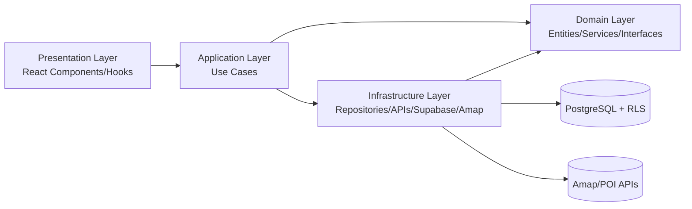
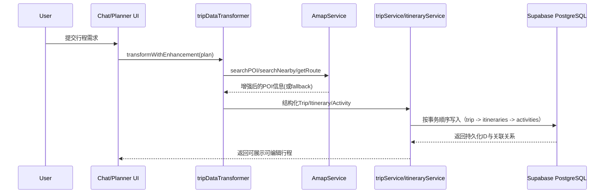
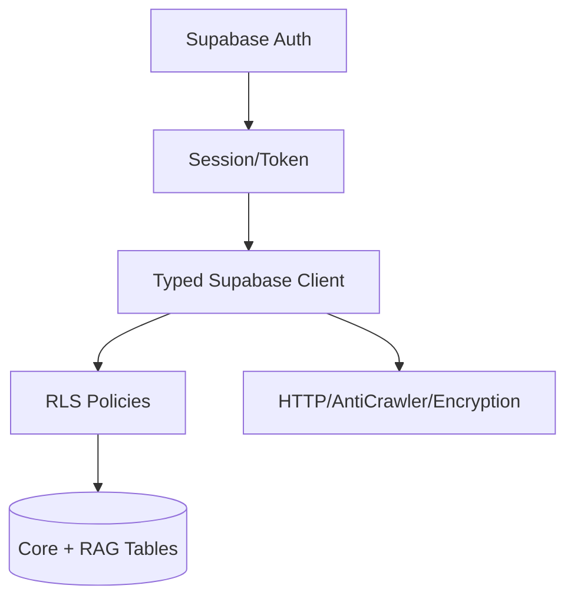

# Methodology

## 1. Methodological framing
本项目采用**设计科学研究（Design Science Research, DSR）+ 工程实证**的混合方法。其核心不是仅验证“模型是否可生成文本”，而是围绕一个明确的工程问题进行可复用系统构建：在中国旅游场景下，如何将本地知识、时空约束与生成式交互整合为可执行的多日行程系统。

方法上分为四个闭环：
- `Problem framing`：从用户规划摩擦（跨平台信息拼接、低可执行性）抽象为系统需求。
- `Artifact design`：以分层架构、检索增强、POI执行层与安全策略构建可部署软件制品。
- `Implementation and iteration`：以路线图与任务分解驱动增量开发与验证。
- `Evaluation planning`：以对照实验设计后续量化评估（AI+RAG vs AI-only vs 主流平台任务流）。

该框架确保设计选择与需求目标一一对应，避免“技术堆叠式开发”。

## 2. Requirements-driven design rationale

### 2.1 Requirement elicitation and traceability
需求来源由三部分组成：
- 项目规格中定义的功能与评估要求（如个性化行程、RAG、地图增强、最小10人用户测试）。
- 现有系统实现边界（已实现与规划中的功能差异）。
- 安全与合规约束（认证、访问控制、数据最小化、可解释性）。

为保证可追溯性，本项目将需求映射到具体设计决策与代码产物。如下表所示：

| Requirement | Design choice | Implementation evidence |
|---|---|---|
| 多日个性化规划且可编辑 | DDD分层 + Use Case编排，避免UI层混入业务规则 | [src/ARCHITECTURE.md](/mnt/d/chinaview/Nodb/src/ARCHITECTURE.md), [CreateTripUseCase.ts](/mnt/d/chinaview/Nodb/src/application/use-cases/CreateTripUseCase.ts) |
| 可执行而非仅可读 | 地图/POI增强作为执行层（地址、营业时间、路线） | [amapService.ts](/mnt/d/chinaview/Nodb/src/services/amapService.ts), [tripDataTransformer.ts](/mnt/d/chinaview/Nodb/src/utils/tripDataTransformer.ts) |
| 数据安全与多租户隔离 | Supabase Auth + PostgreSQL RLS（数据库层权限） | [002_create_core_tables.sql](/mnt/d/chinaview/Nodb/supabase/migrations/002_create_core_tables.sql), [client.ts](/mnt/d/chinaview/Nodb/src/utils/supabase/client.ts) |
| 社交发现与互动统计 | shared_trips + user_interactions + 触发器计数 | [002_create_core_tables.sql](/mnt/d/chinaview/Nodb/supabase/migrations/002_create_core_tables.sql) |
| 面向RAG的知识扩展 | 独立知识库表 + pgvector + 语义检索函数 | [003_create_rag_tables.sql](/mnt/d/chinaview/Nodb/supabase/migrations/003_create_rag_tables.sql) |

这种“需求-设计-实现”三段映射是本项目论证设计合理性的核心证据。

## 3. Design of the solution and justification of choices

### 3.1 Why DDD + layered architecture
项目采用 Domain/Application/Infrastructure/Presentation 四层结构，而非功能杂糅的组件式堆叠。选择理由是：
- 旅游规划涉及长期演进的业务规则（行程、活动、分享、偏好、权限），DDD可降低规则漂移风险。
- Use Case 层将“业务动作”显式化（如创建行程、获取我的行程、分享行程），提升可测试性与复用性。
- Infrastructure 层隔离外部依赖（Supabase、地图API、反爬模块），便于替换和降级。

该设计直接回应项目需求中的“可扩展、可维护、可迭代”。相关架构定义见 [src/ARCHITECTURE.md](/mnt/d/chinaview/Nodb/src/ARCHITECTURE.md)。

### 3.2 Why PostgreSQL + Supabase instead of KV-style storage
项目在方案阶段比较了 KV 与 PostgreSQL，并最终采用 Supabase PostgreSQL。主要论证为：
- 关系约束可原生表达 trip -> itinerary -> activities 的层级一致性，减少应用层手工校验。
- RLS 可在数据库层执行访问控制，避免仅在 API/UI 层做脆弱鉴权。
- 统计字段（点赞/收藏）可通过触发器自动维护，减少并发下的业务错误。
- 后续RAG扩展需要向量索引与结构化过滤，关系模型更利于统一管理。

相关实施证据与比较见 [src/docs/ROADMAP.md](/mnt/d/chinaview/Nodb/src/docs/ROADMAP.md), [src/docs/IMPLEMENTATION_TODO.md](/mnt/d/chinaview/Nodb/src/docs/IMPLEMENTATION_TODO.md), [IMPLEMENTATION_REPORT.md](/mnt/d/chinaview/Nodb/IMPLEMENTATION_REPORT.md)。

### 3.3 Why RAG-ready schema even with phased frontend integration
虽然前端仍有部分模块处于 mock/过渡状态，但数据库已提前建设 RAG-ready 结构（destinations, attractions, restaurants, transportation, travel_tips, trip_examples）。这是一种“先数据地基，后交互闭环”的设计策略，理由是：
- 行程质量瓶颈首先在知识质量与检索质量；
- 数据模型稳定后再迭代UI，可以降低架构返工成本；
- 便于后续进行离线评估与在线AB测试。

证据见 [003_create_rag_tables.sql](/mnt/d/chinaview/Nodb/supabase/migrations/003_create_rag_tables.sql)。

### 3.4 Why map enrichment is treated as execution layer
地图服务（Amap）在本项目中不被定义为“展示增强”，而是“执行增强”。具体体现在：
- `searchPOI/searchNearby/getRoute` 提供地点核验与时空可达性基础。
- 本地缓存（TTL）与失败回退保证服务波动时的可用性。
- `tripDataTransformer` 在写库前进行活动增强，减少“看起来合理但落地失败”的活动条目。

证据见 [amapService.ts](/mnt/d/chinaview/Nodb/src/services/amapService.ts), [tripDataTransformer.ts](/mnt/d/chinaview/Nodb/src/utils/tripDataTransformer.ts)。

### 3.5 Security-by-design choices
安全设计被前置到架构层，而非后补：
- 认证：Supabase Auth + 客户端会话管理。
- 授权：数据库级 RLS 策略。
- 结构化防护：触发器/约束/索引共同降低数据异常与越权风险。
- 运行时防护：HTTP 拦截、反爬组件、请求签名/加密模块。

证据见 [src/SECURITY_GUIDE.md](/mnt/d/chinaview/Nodb/src/SECURITY_GUIDE.md), [src/ANTI_CRAWLER_GUIDE.md](/mnt/d/chinaview/Nodb/src/ANTI_CRAWLER_GUIDE.md), [002_create_core_tables.sql](/mnt/d/chinaview/Nodb/supabase/migrations/002_create_core_tables.sql)。

## 4. Evidence of professional software practice and version control

### 4.1 Repository as single source of truth
项目全部核心产物纳入同一代码仓库管理，包括：
- 架构文档与开发规范；
- 数据库迁移脚本；
- 服务层实现与UI组件；
- 种子脚本与对接记录。

这符合“文档、代码、数据模型同源管理”的专业实践。

### 4.2 Versioning evidence and limitations
可验证的仓库历史显示当前提交历史为里程碑式（2个主提交，`first_version` 与 `init`），并非细粒度 feature-commit 历史。这意味着：
- `优点`：交付版本清晰，里程碑边界明确。
- `局限`：无法充分展示日常分支合并、代码评审与小步提交证据。

因此，在论文中应如实说明：当前可见历史属于“里程碑压缩历史”，并以迁移文件序列、路线图、任务分解文档和实施报告作为过程性补证 [src/docs/ROADMAP.md](/mnt/d/chinaview/Nodb/src/docs/ROADMAP.md), [src/docs/IMPLEMENTATION_TODO.md](/mnt/d/chinaview/Nodb/src/docs/IMPLEMENTATION_TODO.md), [IMPLEMENTATION_REPORT.md](/mnt/d/chinaview/Nodb/IMPLEMENTATION_REPORT.md)。

### 4.3 Code structure and engineering conventions
尽管提交粒度有限，代码结构体现了良好工程实践：
- 明确分层目录与依赖规则；
- 类型系统贯穿（`Database` 类型、service层类型别名）；
- 迁移脚本按版本组织；
- 脚本工具独立管理（测试用户、数据种子）。

证据见 [src/types/database.ts](/mnt/d/chinaview/Nodb/src/types/database.ts), [src/services/tripService.ts](/mnt/d/chinaview/Nodb/src/services/tripService.ts), [src/services/itineraryService.ts](/mnt/d/chinaview/Nodb/src/services/itineraryService.ts), [scripts/seed-mock-trips.mjs](/mnt/d/chinaview/Nodb/scripts/seed-mock-trips.mjs)。

## 5. Data collection and preparation methodology

### 5.1 Data scope and modeling
本项目把数据分为三类：
- `transactional data`：用户、行程、日程、活动、分享互动；
- `knowledge data`：目的地、景点、餐厅、交通、旅行建议、案例；
- `detail enrichment data`：餐厅菜品、交通路线、活动外键映射。

通过关系模型 + 向量字段并行设计，支持“结构化查询 + 语义检索”双通路。

### 5.2 Data preparation pipeline
当前已落地的数据准备流程包括：
1. 迁移创建核心与RAG表结构。
2. 编写种子脚本将 mock 行程与 POI 详情写入数据库。
3. 通过外键（restaurant_id/attraction_id/transport_route_id）实现活动到详情实体的可追踪绑定。
4. 在前端详情页按外键实时拉取详情并保留 fallback。

证据见 [scripts/seed-mock-trips.mjs](/mnt/d/chinaview/Nodb/scripts/seed-mock-trips.mjs), [src/docs/POI_DATA_MIGRATION.md](/mnt/d/chinaview/Nodb/src/docs/POI_DATA_MIGRATION.md)。

### 5.3 Data quality controls
数据质量控制采用“数据库约束 + 写入前校验 + 失败回退”三层机制：
- 数据库层：主外键、唯一约束、检查约束、触发器自动维护关键字段。
- 转换层：日期解析、活动类型映射、地理信息增强。
- 运行层：API错误重试、缓存过期剔除、增强失败回退到原计划。

## 6. Software architecture (schematic + description)

### 6.1 Overall layered architecture

该结构保证业务规则不被UI和外部依赖污染，满足可测试性与可演进性。

### 6.2 Data flow for AI plan persistence

### 6.3 Security architecture sketch

核心思想是“认证与授权分层”：Auth 管身份，RLS 管数据边界，减少越权面。

## 7. Project management methodology

### 7.1 Delivery model
项目采用**阶段化里程碑 + 任务分解（WBS）**方法：
- 阶段1：数据库与认证基础。
- 阶段2：核心行程管理。
- 阶段3：分享互动与统计。
- 阶段4：数据初始化、性能与测试。

每阶段包含明确产出物（migration/service/page/script），并在文档中定义验收条件。

### 7.2 Planning artefacts
计划与执行主要由以下工件支撑：
- 路线图（按周/日里程碑）；
- 待办清单（优先级P0/P1/P2）；
- 实施报告（数据库执行与风险反馈）；
- 规格工件（requirements/design/tasks）。

证据见 [src/docs/ROADMAP.md](/mnt/d/chinaview/Nodb/src/docs/ROADMAP.md), [src/docs/IMPLEMENTATION_TODO.md](/mnt/d/chinaview/Nodb/src/docs/IMPLEMENTATION_TODO.md), [IMPLEMENTATION_REPORT.md](/mnt/d/chinaview/Nodb/IMPLEMENTATION_REPORT.md), [ai-planner-data-enhancement/requirements.md](/mnt/d/chinaview/Nodb/.kiro/specs/ai-planner-data-enhancement/requirements.md), [ai-planner-data-enhancement/design.md](/mnt/d/chinaview/Nodb/.kiro/specs/ai-planner-data-enhancement/design.md), [ai-planner-data-enhancement/tasks.md](/mnt/d/chinaview/Nodb/.kiro/specs/ai-planner-data-enhancement/tasks.md)。

### 7.3 Why this management approach is justified
该方法优于“功能堆叠式开发”的原因是：
- 将高风险基础能力（数据模型、权限、认证）前置，避免后期重构成本。
- 通过文档化验收标准提升跨阶段可验证性。
- 支持“先稳定地基，再扩展交互”的策略，与当前项目状态一致。

## 8. Methodological limitations and mitigation
- `Version-control evidence granularity`：当前仓库公开历史为里程碑级，缺少细粒度开发轨迹。已通过路线图、任务文档、迁移序列与实施报告补证，但仍建议后续采用 feature branch + PR 记录以增强审计性。
- `Frontend integration completeness`：部分页面仍在 mock 过渡态。论文中已将“架构可行性”与“端到端效果”分开论证，避免过度主张。
- `RAG online evaluation`：知识层已搭建，但系统性在线对照评估仍需在后续实验章节完成。

## 9. Summary
本方法论以需求可追溯性为主轴，将设计选择、工程实现、数据准备与项目管理整合为一个可审计的开发过程。其贡献在于：
- 通过 DDD + RLS + RAG-ready schema 建立可扩展且安全的系统地基；
- 通过地图执行层与数据增强流程提高行程“可执行性”；
- 通过路线图与任务分解维持开发节奏与交付质量；
- 在局限可见的前提下提供诚实、可复核的证据链。

该方法满足“设计有论证、实现有证据、管理有过程”的研究型软件工程要求，并为后续评估章节提供了可直接继承的方法基础。
